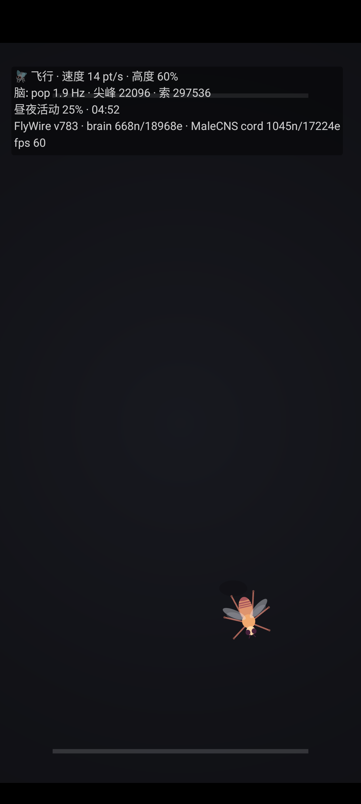

# desktop-fly-android

[](LICENSE)
[](assets/data/DATA_LICENSE.md)

[DesktopFly](https://github.com/DenisSergeevitch/desktop-fly) 的安卓移植 MVP：点开 app，
一只由**真实连接组回路**驱动的果蝇在屏幕里生活。非桌宠形态（不做悬浮窗）。



## 它是真的

- **大脑**：FlyWire v783 雌脑逃生/转向回路，668 神经元 / 18,968 突触，1 kHz LIF 仿真
  （LC4/LPLC2 looming 检测器 → DNp01 巨纤维逃生，DNa01/02 转向，MDN 倒退，DNp09 前进，DNg11 理毛）
- **神经索**：MaleCNS v1.0 运动回路，1,045 神经元 / 17,224 连接，下行命令 → 六腿肌肉通道
- **身体**：600 Hz 铰接腿动力学 + 刚体位移拟合，步态是回路真实涌现的，不是预设动画
- 移植自 Swift（JVM 自测与 `DesktopFly --simtest` 指标对照通过：组大小逐一相同、
  loom→GF 首尖峰同为 4 ms、刺激与端到端行为全部复现）

## 交互

| 手势 | 果蝇感受 |
|---|---|
| 手指按住/拖近 | looming 威胁（逼急了会飞逃） |
| 快速滑动 | 风吹（air puff 感觉通路） |
| 点一下 | 戳桌面（距离衰减的感觉刺激） |
| 屏幕 顶/底 边 | 窗台，可以落上去走 |
| 深夜闲置 10 分钟（或任意时段 30 分钟） | 按昼夜节律睡觉（早晚活动高峰、午休低谷） |

感官距离阈值（悬停/风/点按/威胁衰减）按屏幕短边归一化，手机与桌面保持同样的空间语义。

## 温度

果蝇是变温动物：设备越热，腿动力学时钟越快（tempo 1.0/1.15/1.35/1.5，
与 macOS 版 thermalTempo 相同映射）。API 29+ 读 PowerManager 热状态等级，
更旧系统回退电池温度（≥36/40/44 °C 分档），每 2 秒轮询一次。

## 状态说明

HUD 左上角实时显示：行为状态、速度、群体放电率、累计尖峰数、昼夜活动水平。

## 构建

无 gradle、无 androidx、无第三方依赖：

```sh
./build.sh          # 产出 DesktopFly-MVP.apk（aapt2+javac+d8+apksigner）
```

依赖：Android SDK（build-tools 35、platform android-34），路径可用 `ANDROID_SDK` 覆盖。
签名 keystore：`~/.android/desktop-fly-mvp.keystore`（自签，首次构建自动生成）。

## 测试

```sh
javac -d build/jvm $(find src/com/maltjuice/fly/core test -name '*.java')
java -cp build/jvm com.maltjuice.fly.core.SimTestMirror     # --simtest 逐值镜像（不挂索，TestRandom 固定种子）
java -cp build/jvm com.maltjuice.fly.core.LocomotorMirror   # 17 项因果/连续性回归（locomotortest 移植）
java -cp build/jvm com.maltjuice.fly.core.SelfTest          # 挂索 app 配置 + 端到端
java -cp build/jvm com.maltjuice.fly.core.PerfTest          # 5 分钟闭环行为+性能（393x873 dp 真机场地）
```

随机流忠实移植 Swift `TestRandom`（FNV-1a 标签 → LCG32，Float/Double 双精度路径）：
SimTestMirror 七相输出与 macOS 参考实现逐值一致（pop 5.21、loom→GF 2 发 @4 ms、
walk-on 42%、午休 17%、气流 GF 13、左眼 −3.0 Hz、groom 193）；LocomotorMirror
的六腿招募峰值、yaw 三元组、60/120 Hz 不变性、热耦合误差 0.0 等全部逐值命中。
未播种时（app 运行态）回退真随机，与原版行为相同。

## 结构

- `src/…/core/` 纯 Java 仿真核心（对应 Swift 的 Sim/Locomotor/LegDynamics/FlyModel 行为层），
  Android 与 JVM 测试共用，零 Android 依赖
- `src/…/app/` Activity + FlyView（Choreographer 主循环 + 触摸感官 + 温度耦合）+ FlyRenderer（2D 俯视 Canvas）
- `assets/data/` circuit.json + locomotor_circuit.json（来自 desktop-fly 仓库，数据许可见其 LICENSE）
- `test/` JVM 回归套件；`FIDELITY-AUDIT-2026-09-26.md` 第三方忠实性审计报告（B1–B6 已全部处置）

## 与 macOS 版的差异

- 渲染：SceneKit 3D → Canvas 2D 俯视（果蝇程序化绘制，非贴图）
- 感官：光标/键盘/窗口 → 触摸/手势（键盘振动、新窗口 looming 无手机对应物，未移植）；
  窗口窗台 → 屏幕顶底边
- 温度：thermalState → PowerManager 热状态（API 29+）/电池温度，映射相同
- 未移植：大脑可视化窗口（23,210 soma）、锹甲皮肤、多显示器、多果蝇

## 致谢与许可

- 仿真内核与行为层移植自 [DenisSergeevitch/desktop-fly](https://github.com/DenisSergeevitch/desktop-fly)
  （MIT），本项目代码同样以 [MIT](LICENSE) 发布
- 大脑回路数据来自 [FlyWire](https://flywire.ai)（FAFB v783，普林斯顿大学及合作机构，
  Nature 2024），经上游项目导出，遵循 **CC BY-NC 4.0**（署名-非商业）
- 神经索数据来自 [MaleCNS v1.0](https://male-cns.janelia.org/)（HHMI Janelia FlyEM、
  剑桥大学、MRC LMB 与 Google Research 合作，Cell 2026），遵循 **CC BY 4.0**
- 完整许可与引用条目见 [assets/data/DATA_LICENSE.md](assets/data/DATA_LICENSE.md)；
  第三方忠实性审计报告见 [FIDELITY-AUDIT-2026-09-26.md](FIDELITY-AUDIT-2026-09-26.md)
